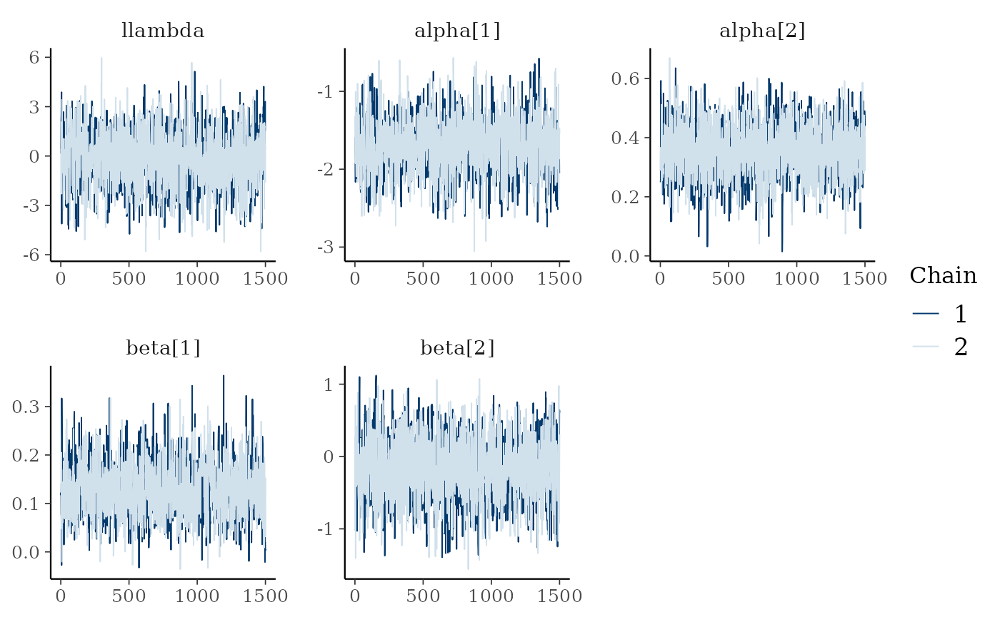
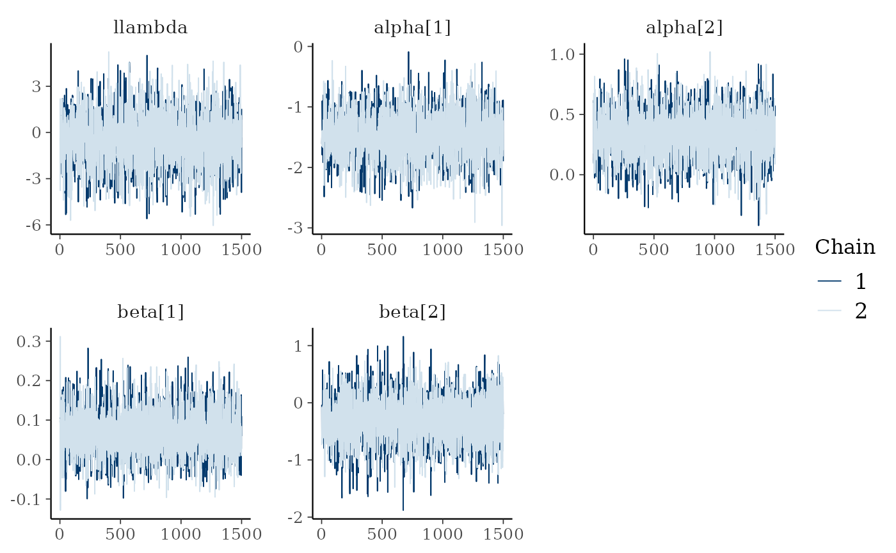

# Fitting a model using cmdstanr

``` r

library(MortalMove)
library(cmdstanr)
#> This is cmdstanr version 0.9.0.9000
#> - CmdStanR documentation and vignettes: mc-stan.org/cmdstanr
#> - Use set_cmdstan_path() to set the path to CmdStan
#> - Use install_cmdstan() to install CmdStan
set_cmdstan_path("YOUR_CMDSTAN_PATH") # Set your cmdstan path here
#> Warning: CmdStan path not set. Can't find directory: YOUR_CMDSTAN_PATH
```

## Simulating data

``` r

sim <- simulate_data(n_animals = 100, n_fixes = 200, n_dead = 20, n_knots = 25)
sim[["raw_data"]] <- NULL
sim[["ind_cell_effect"]] <- 0
```

## Fit stan model using cmdstan

``` r

model_file <- system.file("stan/mortality_model.stan", package = "MortalMove")
mod <- cmdstan_model(model_file, exe_file = system.file("stan/mortality_model.exe", package = "MortalMove"))
fit <- mod$sample(
  data = sim,
  chains = 2,
  parallel_chains = 2,
  iter_warmup = 500,
  iter_sampling = 1500,
  seed = 123
)
```

## Check diagnostics

``` r

diagnostic_fit(fit, plot = TRUE, observed_y = rowSums(sim$time_step, na.rm = TRUE), delta = sim$delta)
#> This is posterior version 1.7.0
#> 
#> Attaching package: 'posterior'
#> The following object is masked from 'package:FNN':
#> 
#>     entropy
#> The following objects are masked from 'package:stats':
#> 
#>     mad, sd, var
#> The following objects are masked from 'package:base':
#> 
#>     %in%, match
#> This is bayesplot version 1.15.0
#> - Online documentation and vignettes at mc-stan.org/bayesplot
#> - bayesplot theme set to bayesplot::theme_default()
#>    * Does _not_ affect other ggplot2 plots
#>    * See ?bayesplot_theme_set for details on theme setting
#> 
#> Attaching package: 'bayesplot'
#> The following object is masked from 'package:posterior':
#> 
#>     rhat
#> This is loo version 2.9.0
#> - Online documentation and vignettes at mc-stan.org/loo
#> - As of v2.0.0 loo defaults to 1 core but we recommend using as many as possible. Use the 'cores' argument or set options(mc.cores = NUM_CORES) for an entire session.
#> 
#> Attaching package: 'loo'
#> The following object is masked from 'package:posterior':
#> 
#>     gpdfit
#> # A tibble: 5 × 5
#>   variable   mean     sd      q5    q95
#>   <chr>     <dbl>  <dbl>   <dbl>  <dbl>
#> 1 beta[1]   0.130 0.0548  0.0468  0.223
#> 2 beta[2]  -0.169 0.422  -0.882   0.519
#> 3 alpha[1] -1.71  0.348  -2.26   -1.13 
#> 4 alpha[2]  0.354 0.0887  0.208   0.496
#> 5 llambda  -0.195 1.67   -3.01    2.49 
#> 
#> --- Rhat and ESS Summary ---
#> # A tibble: 5 × 4
#>   variable  rhat ess_bulk ess_tail
#>   <chr>    <dbl>    <dbl>    <dbl>
#> 1 beta[1]   1.00    1605.    1934.
#> 2 beta[2]   1.00    2407.    1981.
#> 3 alpha[1]  1.00    1558.    1634.
#> 4 alpha[2]  1.00    2055.    1564.
#> 5 llambda   1.00    1634.    1593.
#> 
#> Computed from 3000 by 100 log-likelihood matrix.
#> 
#>          Estimate   SE
#> elpd_loo   -132.9 25.1
#> p_loo         2.3  0.5
#> looic       265.7 50.1
#> ------
#> MCSE of elpd_loo is 0.0.
#> MCSE and ESS estimates assume independent draws (r_eff=1).
#> 
#> All Pareto k estimates are good (k < 0.7).
#> See help('pareto-k-diagnostic') for details.
#> 
#> Posterior predictive p-value summary:
#>   variable p_value
#> 1   Failed  0.3000
#> 2 Censored  0.7125
bayesplot::mcmc_trace(fit$draws(c("llambda","alpha","beta")))
```



## Fit with spatial autocorrelation

``` r

# Fit with spatial autocorrelation
sim[["ind_cell_effect"]] <- 1
model_file <- system.file("stan/mortality_model.stan", package = "MortalMove")
mod <- cmdstan_model(model_file, exe_file = system.file("stan/mortality_model.exe", package = "MortalMove"))

# run fewer iterations due to time constraint
fit_spat <- mod$sample(
  data = sim,
  chains = 2,
  parallel_chains = 2,
  iter_warmup = 500,
  iter_sampling = 1500,
  seed = 123
)
```

``` r

diagnostic_fit(fit_spat, plot = TRUE, observed_y = rowSums(sim$time_step, na.rm = TRUE), delta = sim$delta)
#> # A tibble: 5 × 5
#>   variable    mean     sd       q5    q95
#>   <chr>      <dbl>  <dbl>    <dbl>  <dbl>
#> 1 beta[1]   0.0697 0.0593 -0.0252   0.171
#> 2 beta[2]  -0.316  0.416  -0.988    0.355
#> 3 alpha[1] -1.46   0.385  -2.09    -0.828
#> 4 alpha[2]  0.330  0.200  -0.00211  0.656
#> 5 llambda  -0.515  1.72   -3.39     2.29 
#> 
#> --- Rhat and ESS Summary ---
#> # A tibble: 5 × 4
#>   variable  rhat ess_bulk ess_tail
#>   <chr>    <dbl>    <dbl>    <dbl>
#> 1 beta[1]  1.000    5544.    2325.
#> 2 beta[2]  1.00     6495.    2025.
#> 3 alpha[1] 1.00     3214.    2295.
#> 4 alpha[2] 1.000    4593.    2214.
#> 5 llambda  1.00     3087.    2266.
#> 
#> Computed from 3000 by 100 log-likelihood matrix.
#> 
#>          Estimate   SE
#> elpd_loo   -125.2 24.3
#> p_loo         6.7  1.7
#> looic       250.5 48.6
#> ------
#> MCSE of elpd_loo is 0.1.
#> MCSE and ESS estimates assume independent draws (r_eff=1).
#> 
#> All Pareto k estimates are good (k < 0.7).
#> See help('pareto-k-diagnostic') for details.
#> 
#> Posterior predictive p-value summary:
#>   variable p_value
#> 1   Failed    0.40
#> 2 Censored    0.65
bayesplot::mcmc_trace(fit_spat$draws(c("llambda","alpha","beta")))
```


