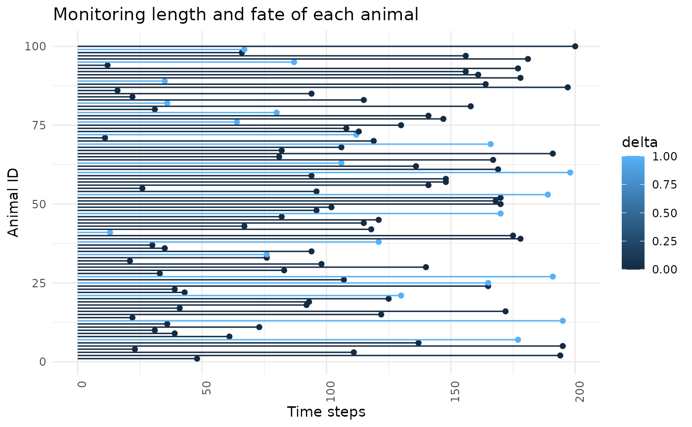
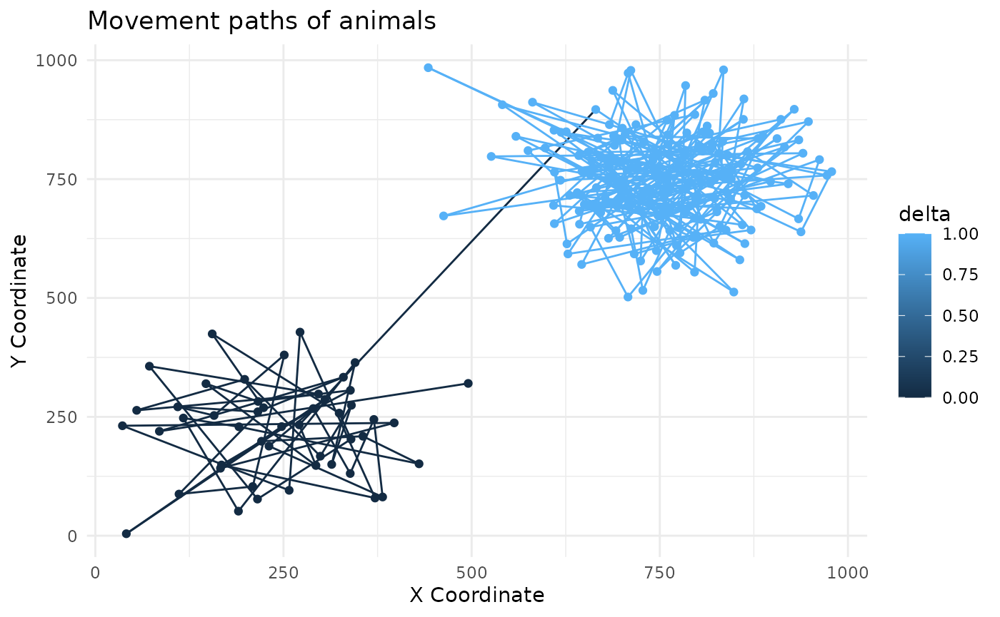
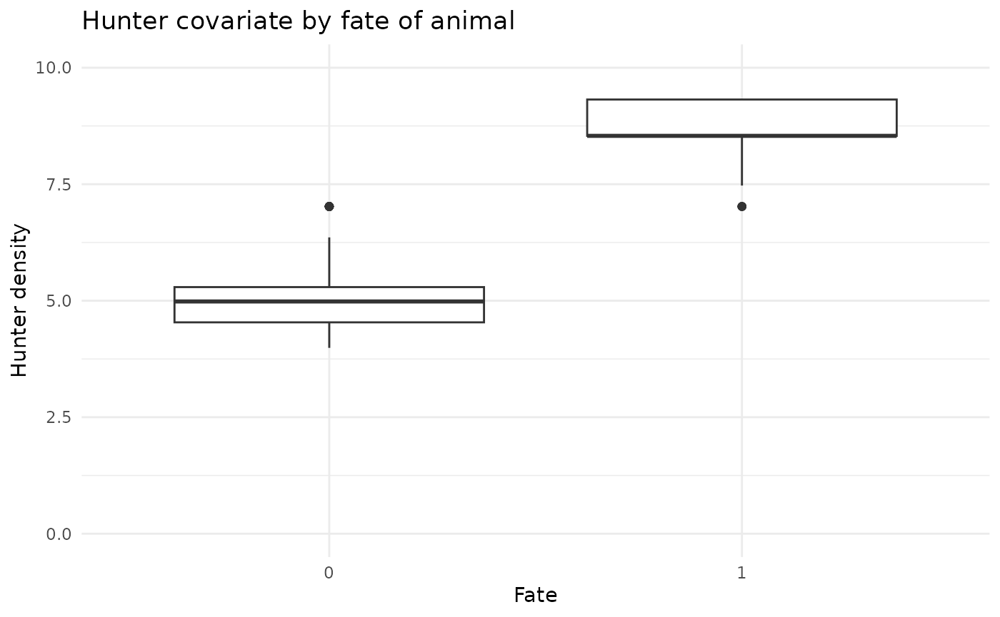
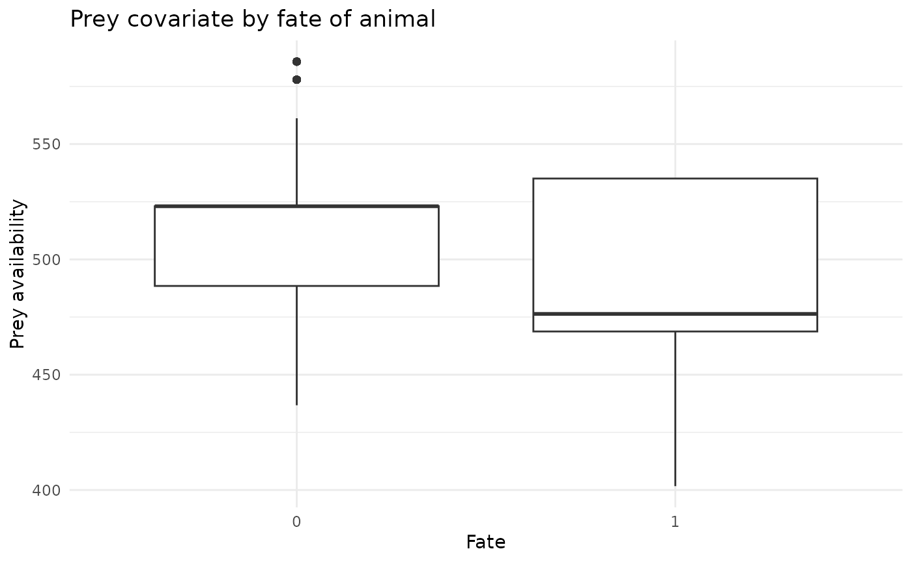

# Simulating Animal Movement and Mortality Data

## Simulate a dataset

``` r

sim <- simulate_data(n_animals = 100, n_fixes = 200, n_dead = 20, n_knots = 25)
str(sim, max.level = 1)
#> List of 19
#>  $ n              : num 100
#>  $ max_locs       : num 200
#>  $ n_locs         : num [1:100] 48 194 111 23 195 137 177 61 39 31 ...
#>  $ time_step      : num [1:100, 1:200] 1 1 1 1 1 1 1 1 1 1 ...
#>  $ delta          : num [1:100(1d)] 0 0 0 0 0 0 1 0 0 0 ...
#>   ..- attr(*, "dimnames")=List of 1
#>  $ n_knots        : num 25
#>  $ knots_ce       : num [1:25, 1:2] 100 300 500 700 900 100 300 500 700 900 ...
#>   ..- attr(*, "dimnames")=List of 2
#>  $ sigma          : num 1
#>  $ rho            : num 100
#>  $ cell_mat       : num [1:100, 1:200] 8 6 7 2 6 6 20 6 3 7 ...
#>   ..- attr(*, "dimnames")=List of 2
#>  $ ind_cell_effect: num 1
#>  $ beta_prior     : num [1:2] 0 1
#>  $ llambda_prior  : num [1:2] 0 2
#>  $ alpha_prior    : num [1:2] 0 1
#>  $ num_hab_covs   : num 2
#>  $ hab_cov        : num [1:100, 1:200, 1:2] 5.18 4.88 5.23 5.86 4.88 ...
#>  $ num_indv_covs  : num 2
#>  $ z              : num [1:100, 1:2] 16 20 6 11 8 7 20 17 18 17 ...
#>   ..- attr(*, "dimnames")=List of 2
#>  $ raw_data       :'data.frame': 10957 obs. of  9 variables:
```

## Plot out simulated dataset - individual monitoring length and fate

``` r

df <- data.frame(id = 1:sim$n, n_locs  = sim$n_locs, delta = sim$delta)

ggplot(df, aes(x = id, y = n_locs)) +
  geom_point(aes(color = delta)) +
  geom_segment(aes(xend = id, yend = 0, color = delta)) +
  labs(x = "Animal ID", y = "Time steps") +
  theme_minimal() +
  ggtitle("Monitoring length and fate of each animal") +
  theme(axis.text.x = element_text(angle = 90, hjust = 1)) +
  coord_flip()
```



## Plot out simulated dataset - individual movement paths

``` r

df <- sim$raw_data
df <- df[df$animal_id %in% c(1,13),]
ggplot(df, aes(x = x, y = y, color = delta)) +
  geom_path() +
  geom_point() +
  labs(x = "X Coordinate", y = "Y Coordinate") +
  theme_minimal() +
  ggtitle("Movement paths of animals")
```



## Plot some covariates by fate

``` r

df <- sim$raw_data
df$delta <- as.factor(df$delta)
ggplot(df, aes(x = delta, y = hunter)) +
  geom_boxplot() +
  labs(x = "Fate", y = "Hunter density") +
  theme_minimal() +
  ggtitle("Hunter covariate by fate of animal") +
  scale_y_continuous(limits = c(0, 10))
```



``` r


ggplot(df, aes(x = delta, y = prey_avail)) +
  geom_boxplot() +
  labs(x = "Fate", y = "Prey availability") +
  theme_minimal() +
  ggtitle("Prey covariate by fate of animal")
```


